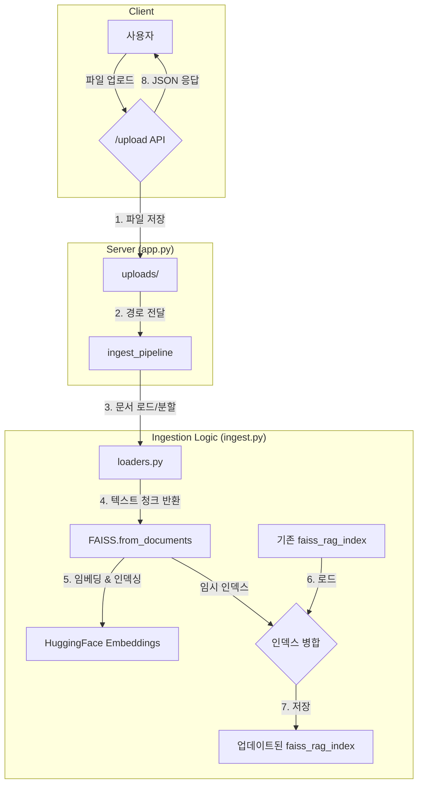

# RAG 문서 인덱싱 파이프라인

## 1. 개요

이 프로젝트는 PDF, DOCX, DOC 형식의 파일을 업로드받아 처리하고, 검색 증강 생성(RAG)에 사용될 수 있는 FAISS 벡터 인덱스에 추가하는 자동화된 파이프라인입니다.

주요 기능은 다음과 같습니다.
- **파일 처리**: `.pdf`, `.docx`, `.doc` 파일을 파싱하여 텍스트를 추출하고 의미있는 단위(청크)로 분할합니다.
- **임베딩**: `Sentence-Transformers` (`BAAI/bge-large-en-v1.5`) 모델을 사용하여 텍스트 청크를 고차원 벡터로 변환합니다.
- **인덱스 관리**: 변환된 벡터를 `FAISS` 인덱스에 저장합니다. 기존 인덱스가 있을 경우, 새로운 데이터를 병합(`merge_from`)하여 업데이트합니다.
- **API 제공**: Flask 기반의 REST API (`/upload`)를 통해 파일을 업로드하고 인덱싱 파이프라인을 트리거할 수 있습니다.
- **CLI 지원**: 터미널에서 직접 `ingest.py` 스크립트를 실행하여 로컬 파일을 인덱싱할 수 있습니다.

## 2. 시스템 아키텍처



## 3. 설치

먼저, 프로젝트 저장소를 클론하고 필요한 Python 패키지를 설치합니다.

```bash
# 1. 프로젝트 클론
git clone <repository-url>
cd <repository-directory>

# 2. (권장) 가상 환경 생성 및 활성화
python -m venv venv
source venv/bin/activate
# 또는 conda 환경 사용
# conda create -n rag38 python=3.10
# conda activate rag38

# 3. 의존성 패키지 설치
pip install -r requirements.txt
```

## 4. 사용법

### 4.1. CLI를 통한 인덱싱

로컬에 있는 문서 파일을 직접 인덱싱할 수 있습니다. `faiss_rag_index` 폴더가 없으면 새로 생성되고, 이미 존재하면 데이터가 추가됩니다.

```bash
python ingest.py path/to/your/document1.pdf path/to/another/document2.docx
```

### 4.2. API 서버 실행 및 파일 업로드

#### 서버 실행

개발 환경에서는 Flask 내장 서버를 사용할 수 있습니다.

```bash
python app.py
```
서버가 `http://0.0.0.0:8888` 에서 실행됩니다.

프로덕션 환경에서는 `gunicorn`과 같은 WSGI 서버 사용을 권장합니다.

```bash
# gunicorn으로 실행 (워커 2개)
gunicorn --workers 2 --bind 0.0.0.0:8888 app:app
```

#### 파일 업로드 테스트 (`curl`)

서버가 실행된 상태에서 `curl` 명령어를 사용하여 파일을 업로드할 수 있습니다.

```bash
curl -X POST -F "file=@/path/to/your/document.pdf" http://127.0.0.1:8888/upload
```

**성공 시 응답:**
```